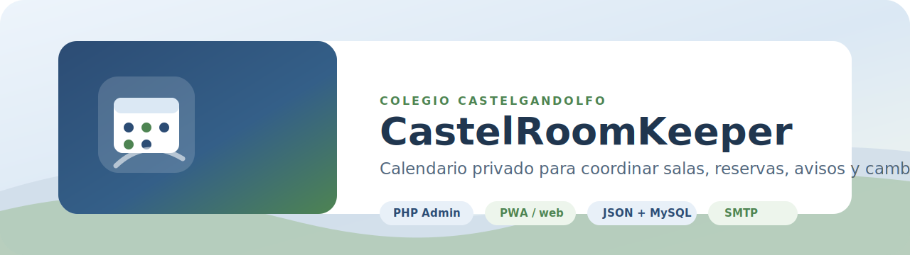
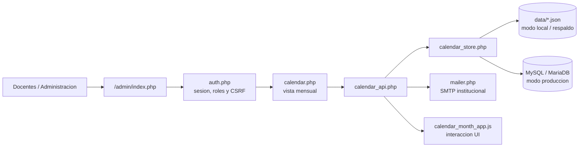
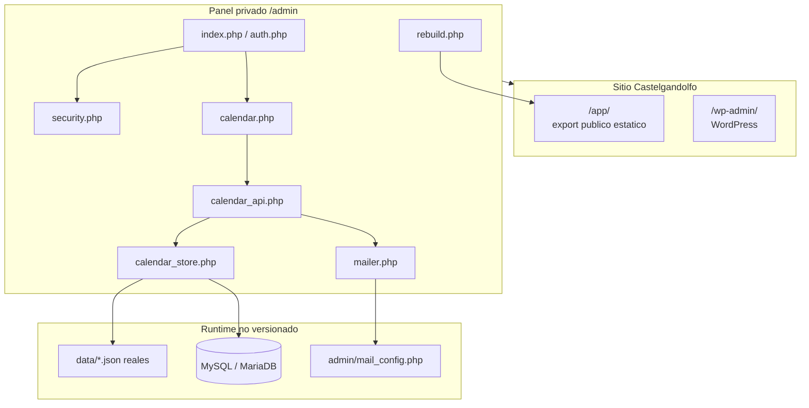
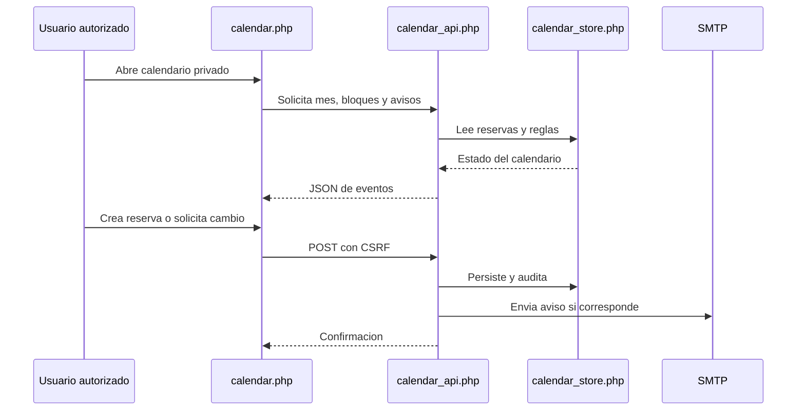
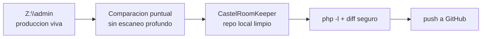

# CastelRoomKeeper



Calendario privado del **Colegio Castelgandolfo** para coordinar la sala de computacion, bloquear horarios, gestionar solicitudes de cambio y enviar avisos por correo. Este repo conserva el codigo del panel que vive bajo `/admin/` en la web del colegio, con ejemplos seguros para correrlo fuera de produccion.

> Produccion real: servidor web del colegio montado localmente como `Z:\`.  
> Este repo: snapshot versionable y sanitizado del calendario/admin. No guarda credenciales, usuarios reales ni reservas reales.

## Que Es

`CastelRoomKeeper` no es un SaaS generico. Es el fork operativo del calendario Castel: un panel PHP integrado al sitio institucional, pensado para que administracion y docentes puedan reservar espacios sin pisarse, auditar cambios y mantener avisos visibles.



## Alcance Real

- Panel privado en `PHP` dentro de `admin/`.
- Calendario mensual para sala de computacion y bloques horarios.
- Reservas, bloqueos, incidencias y solicitudes de cambio.
- Roles de acceso, CSRF, auditoria y bloqueo de login.
- Envio de correos SMTP para avisos y aprobaciones.
- PWA ligera para acceso instalado desde el navegador.
- Backend intercambiable: archivos `JSON` para entorno local y `MySQL/MariaDB` para produccion.
- Integracion visual con la identidad de Castelgandolfo.

## Arquitectura



## Flujo De Reserva



## Estructura

```text
CastelRoomKeeper/
├─ admin/
│  ├─ auth.php                    # Sesion, usuarios, roles, CSRF
│  ├─ calendar.php                # Entrada principal del calendario
│  ├─ calendar_api.php            # API interna del calendario
│  ├─ calendar_month_app.js       # UI mensual moderna
│  ├─ calendar_store.php          # Persistencia JSON / MySQL
│  ├─ mailer.php                  # Envio SMTP
│  ├─ mail_config.example.php     # Plantilla segura, sin secretos
│  ├─ security.php                # Panel de seguridad/admin
│  ├─ sql.php                     # Mantenimiento MySQL
│  ├─ manifest.webmanifest        # PWA del panel
│  └─ sw.js                       # Service worker
├─ app/assets/
│  ├─ ccg-header-logo.css
│  └─ hero-escudo.css
├─ data/
│  ├─ authorized_emails.example.json
│  ├─ calendar_backend.example.json
│  ├─ calendar_notices.example.json
│  ├─ calendar_store.example.json
│  └─ site.example.json
├─ docs/
│  ├─ brand/castel-roomkeeper-banner.svg
│  ├─ diseno-calendario-multiusuario-y-bloqueos.md
│  └─ flujo-correos-calendario-privado.md
└─ .gitignore
```

## Archivos Runtime Que No Se Suben

Estos archivos pertenecen al servidor o al entorno local real. Quedan fuera de Git por seguridad:

- `admin/mail_config.php`
- `data/authorized_emails.json`
- `data/calendar_store.json`
- `data/calendar_backend.json`
- `data/calendar_notices.json`
- `data/admin_login_locks.json`
- `data/admin_tools.json`
- `data/site.json`
- `*.log`
- `*.tmp`

## Modo Local

1. Copia `admin/mail_config.example.php` a `admin/mail_config.php`.
2. Copia `data/authorized_emails.example.json` a `data/authorized_emails.json`.
3. Copia `data/calendar_store.example.json` a `data/calendar_store.json`.
4. Copia o crea los demas JSON runtime segun el modo que quieras probar.
5. Sirve el repo con PHP respetando la ruta `/admin/`.

Ejemplo rapido:

```powershell
cd C:\Users\Jack\Documents\GitHub\Experimentos\Castel\CastelRoomKeeper
php -S 127.0.0.1:8080
```

Luego abre:

```text
http://127.0.0.1:8080/admin/
```

## Produccion Y Sincronizacion

La web viva esta montada como `Z:\` y debe tratarse como produccion. Para sincronizar cambios:



Reglas practicas:

- No hacer busquedas recursivas profundas sobre `Z:\`.
- Copiar solo archivos concretos del panel cuando haga falta.
- No traer `mail_config.php` ni JSON reales de `data/`.
- Validar PHP antes de pushear.
- Mantener este repo separado de `CCAACalendar`.

## Relacion Con CCAACalendar

`CCAACalendar` ya avanzo a otra idea: plataforma universitaria/SaaS para calendarios, reservas y coordinacion institucional.

`CastelRoomKeeper` queda como el calendario Castel real:

- identidad Castelgandolfo;
- rutas `/admin/`, `/app/` y `/wp-admin/`;
- dependencias de produccion del sitio del colegio;
- datos runtime privados fuera del repo.

## Documentacion Relacionada

- [Diseno de calendario multiusuario y bloqueos](docs/diseno-calendario-multiusuario-y-bloqueos.md)
- [Flujo de correos del calendario privado](docs/flujo-correos-calendario-privado.md)

## Seed De Ejemplo

`data/authorized_emails.example.json` contiene usuarios ficticios para pruebas. La contrasena de ejemplo usada por esos seeds es `Cambio123!`.
